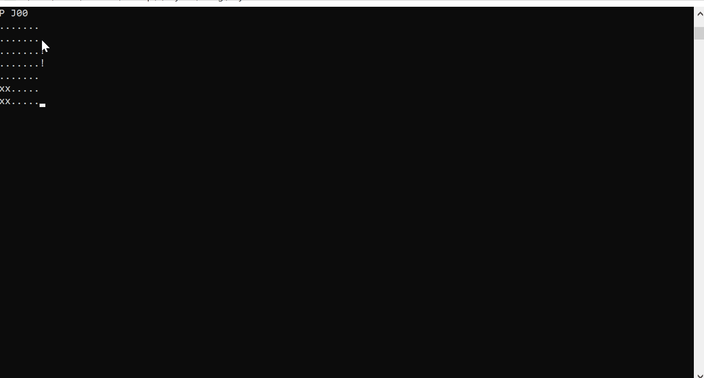

# Safari
Safari Rush Hour, a 7 x 7 grid game (Escape Rover "x" that moves in all directions)

[Safari Rush Hour](https://www.thinkfun.com/products/safari-rush-hour/) is a variation on the popular Rush Hour game from Binary Arts. The object is to move your car through a tangle of obstacles to reach the exit.

## Rules
Safari Rush Hour is played on a 7 x 7 game grid with up to 19 playing pieces (safari rover and animals). The object is to slide the safari rover through the exit gate in the playing grid frame. Each puzzle gives a configuration of animals and the safari rover. To play, you shift the animals and safari rover up, down, left, and right until the path is clear to make your escape. Note: lions, lionesses, impalas, zebras, rhinos, and elephants move only forward and reverse. The large square safari rover and the wild dogs (termite mound) may move up, down, right, and left. No lifting of playing pieces off of the gameboard grid surface once play has begun.

## Input
A sample problem input looks as follows:

>> P J1
>>.......
>>.rrrf..
hh..fq.!
o.xx.q.!
o.xx.q.
ob..ee.
.bppp..

The first line indicates a problem ("P") and the name of the problem ("J1"). The problems are all numbered, and the first letter indicates the difficulty of the problem: "J" is junior, "B" is beginner, "I" is intermediate, "A" is advanced, and "E" is expert. In the puzzle specification, the letters stand for the playing pieces: 2x2 pieces: termite mounds (u,v) and safari rover (x); 3x1 pieces: elephant (o, q, s) and rhino (p, r); 2x1 pieces: lion (a, f), lioness (d, g, j), impala (b, h, i, k) and zebra (c, e). The actual names do not matter; all that is important is the shape of each of the pieces and the way that they move. The "!" indicates the exit (the exit position is fixed and does not change from puzzle to puzzle).

## Solution:

The solution was written using IDA* algorithm. The reported solution is in the format: solution [id] [t] [n] [move_1] ... [move_n] with the solution board indicating the rover (x) has reached the exit where the explanation marks are at.
where [id] is the problem id, [t] is the wallclock time in seconds your program required to find the solution (or "timeout" if your program timed out - see -t options below), [n] is the number of moves and [move_i] is a move encoded by specifying the name of the piece, its move direction ("l"eft, "r"ight, "u"p, or "d"own) followed by the number of squares that the piece moves. For example, a solution line for the puzzle above is:
>> solution J1 0.15 5 el1 qd2 fu1 xu1 xr5
       
### Notes on input

 The game can take a board from stdinput or a file containing a number of different problem boards in the following format:
 >> ./safari -t 200 < mytest-data.data
 

## DEMO:

